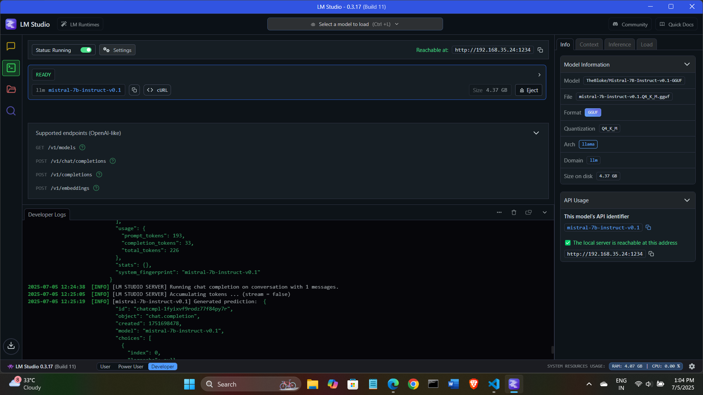

# Tudu - AI-Powered Task Manager (Backend)

Tudu is a smart task management system that uses AI to help users prioritize and manage tasks efficiently. This is the **Django + SQLite backend** powering task operations, AI recommendations, and contextual training.

---

## 🔧 Tech Stack

- **Framework:** Django, Django REST Framework
- **Database:** SQLite
- **AI Integration:** LM Studio (Mistral 7B)
- **Environment:** Python 3.10+, pip, virtualenv

---

## 🚀 Features

- CRUD APIs for tasks, categories, and context inputs
- AI-powered task suggestions (priority, deadline, category)
- Context-aware task improvement using user notes, emails, WhatsApp logs
- Task prioritization recommendation using AI model

---

## 📦 Installation & Setup

1. **Clone the repository:**
   ```bash
   git clone https://github.com/tusharharyana/smart-todo-list-with-AI.git
   cd smart-todo-list-with-AI
2. **Create a virtual environment:**
   ```bash
   python -m venv venv
   source venv/bin/activate  # On Windows: venv\Scripts\activate
3. **Install dependencies:**
   ```bash
   pip install -r requirements.txt
4. **Run migrations:**
   ```bash
   python manage.py migrate
5. **Start the development server:**
   ```bash
   python manage.py runserver
---

## 📦 AI Integration with LM Studio
Tudu uses LM Studio to host and run the open-source Mistral 7B model locally for AI-based enhancements.

## 🧩 Sample AI Suggestion Response
```bash
{
  "improved_description": "Write a blog post on AI ethics and regulation.",
  "priority_score": 0.8,
  "suggested_deadline": "2025-07-10",
  "recommended_category": "Research"
}
```
- Make sure the model is loaded in LM Studio and served on:
    http://192.168.35.24:1234/v1/chat/completions

## API Endpoints

| Endpoint             | Method     | Description                   |
| -------------------- | ---------- | ----------------------------- |
| `/api/tasks/`        | GET/POST   | Task list and create          |
| `/api/tasks/<id>/`   | PUT/DELETE | Edit/delete a task            |
| `/api/categories/`   | GET/POST   | Manage task categories        |
| `/api/contexts/`     | GET/POST   | Add daily notes/emails etc.   |
| `/api/ai/suggest/`   | POST       | Improve task via context + AI |
| `/api/ai/recommend/` | POST       | Recommend most urgent task    |

## LM Studio


## ✨ Acknowledgements
- Mistral 7B
- LM Studio
- Django REST Framework